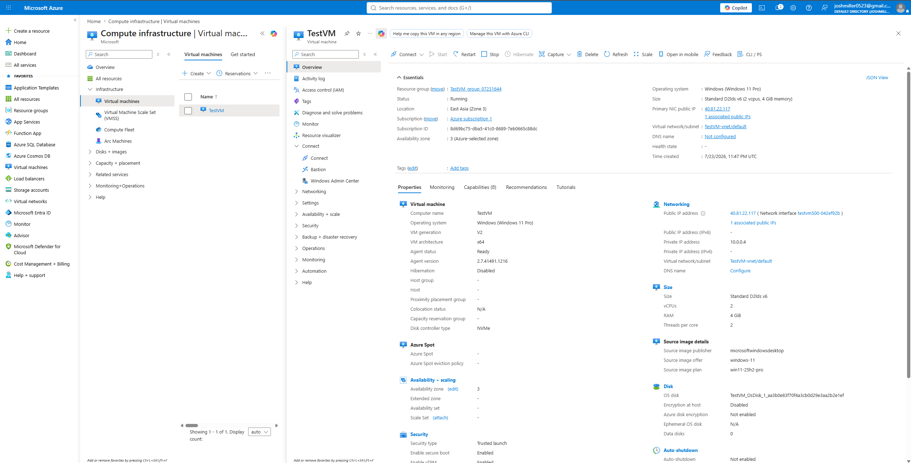
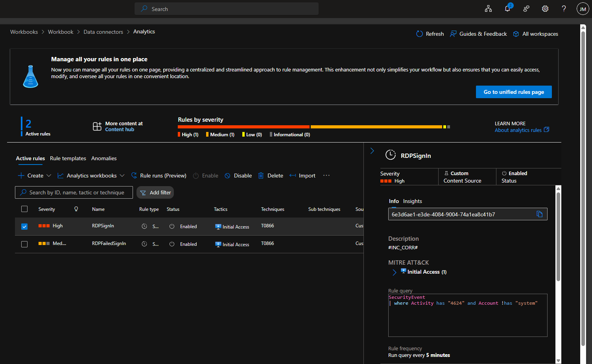
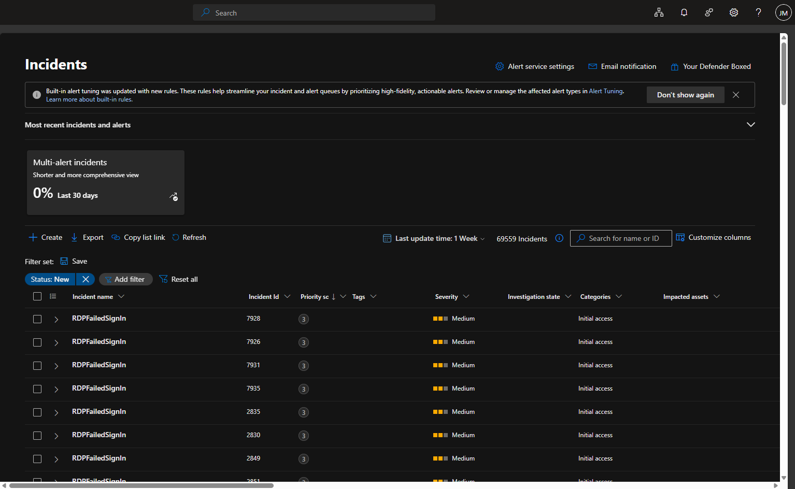
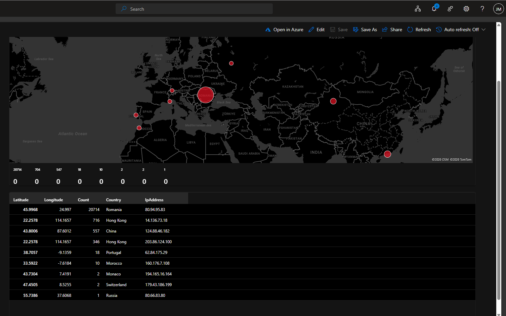
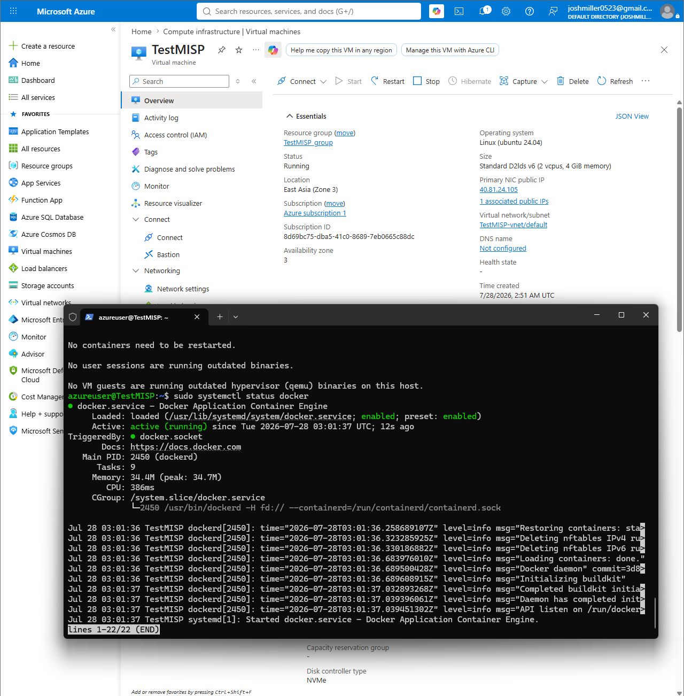
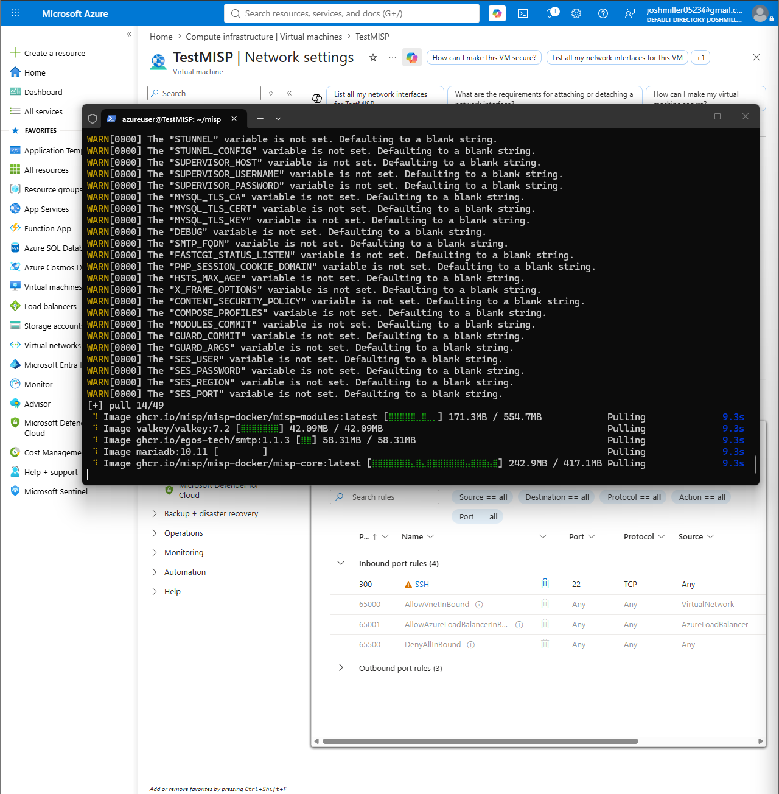
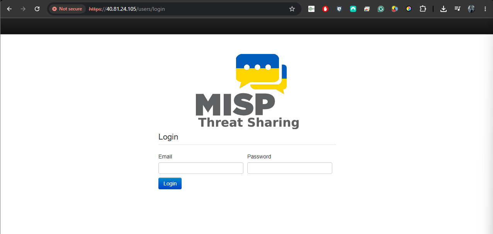
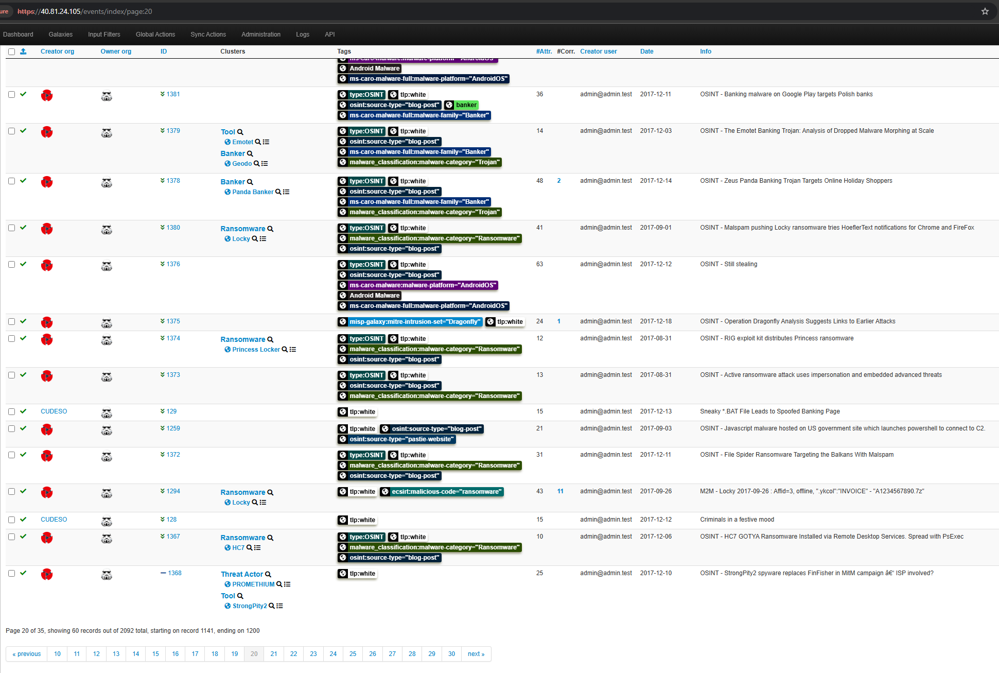
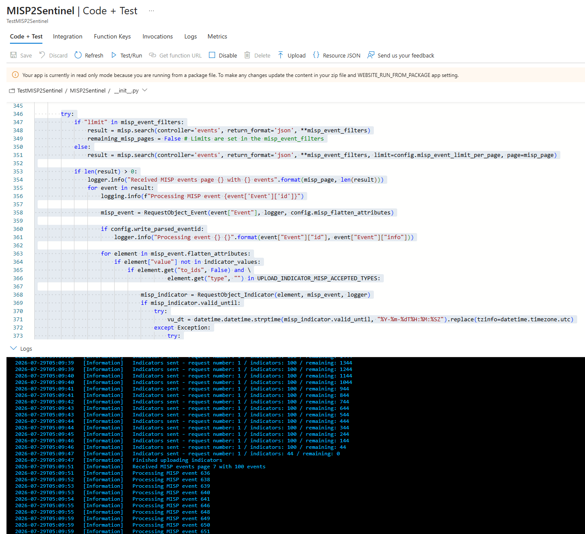

# Projects

This is a showcase of my cybersecurity projects and code I've created.

* * *
## Virtual SOC in Azure

### Honeypot Setup with Detection

*   Signed up for an Azure free trial with $200 in free credits.
*   Created a D2lds v6 (2 vcpus, 4 GiB memory) virtual machine running Windows 11 and port 3389 open.



*   Configured Microsoft Sentinel in a log analytics workspace with Windows Security Events via AMA as a Data Connector.
*   Created detection rules in Sentinel with KQL to detect event 4625 (Attempted RDP sign in) and event 4624 (Successful RDP sign in) to generate incidents in Sentinel




### Honeypot Results

*   Created a heatmap to track IPs and locations of attempted RDP connections using KQL to sort events

```Kusto
SecurityEvent
| where EventID == 4625
| where isnotempty(IpAddress) and IpAddress !in ("127.0.0.1", "::1", "-")
| summarize Count = count() by IpAddress
| extend GeoInfo = geo_info_from_ip_address(IpAddress)
| extend Latitude = toreal(GeoInfo.latitude)
| extend Longitude = toreal(GeoInfo.longitude)
| extend Country = tostring(GeoInfo.country)
| where isnotempty(Latitude) and isnotempty(Longitude) and isnotempty(Country)
| where Latitude between (-90.0 .. 90.0) and Longitude between (-180.0 .. 180.0)
| project Latitude, Longitude, Count, Country, IpAddress
| order by Count desc
```



### MISP Threat Intelligence Platform with Sentinel Integration

*   Created a new Linux (Ubuntu 24.04) server and installed Docker



* Installed MISP onto the Docker image running a web GUI




*   Imported Threat Intelligence into the MISP instance



*   Created an Azure function to send threat indicators to Sentinel via Python script


